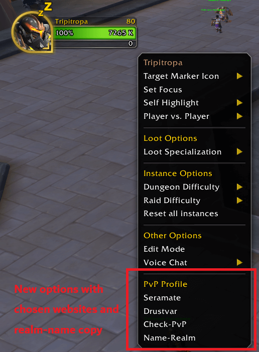
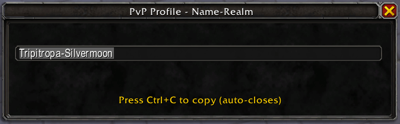
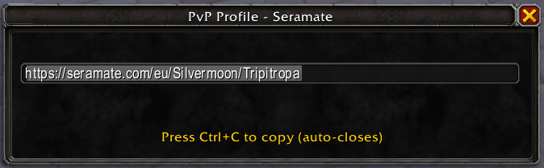
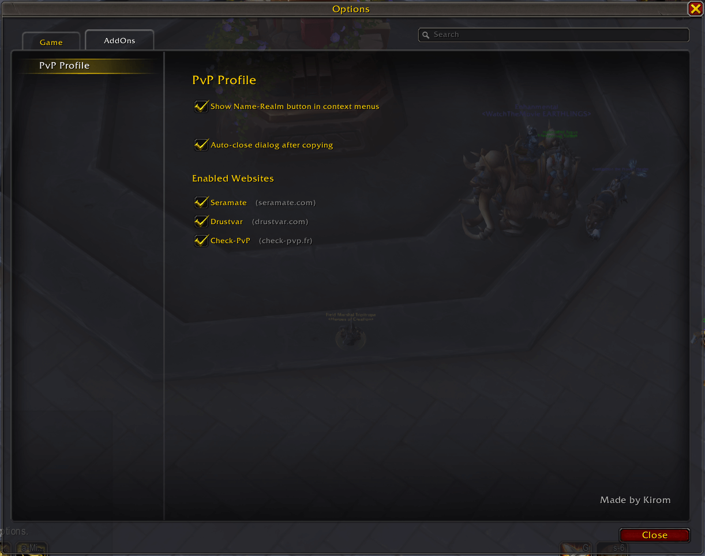

<div align="center">

# PvP Profile

</div>

<div align="center">

[](https://github.com/Kirom/PvP-Profile/releases/latest)
[](https://github.com/Kirom/PvP-Profile/actions)
[](https://www.curseforge.com/wow/addons/pvp-profile)
[](https://addons.wago.io/addons/pvp-profile)

[](https://worldofwarcraft.blizzard.com/ru-ru/midnight)
[](https://github.com/Kirom/PvP-Profile)
[](https://github.com/Kirom/PvP-Profile/issues)

[](https://discord.gg/5sMTavfNsE)

</div>

A modular World of Warcraft addon that provides convenient access to multiple PvP websites through right-click context menus. PvP Profile supports multiple providers and allows users to choose which websites they want to use. Supports LFG search results and applicants and generates full URLs for the player that is selected by default and can be copied to the clipboard immediately with Ctrl+C.

## 🎯 Key Features

* **Multi-Website Support**: Currently supports Check-PvP.fr, Drustvar.com, and Seramate.com with easy expansion for additional sites
* **Configurable Providers**: Enable or disable individual websites through the options panel
* **Direct Menu Integration**: Individual buttons for each enabled website directly in context menus
* **Right-click Integration**: Works on LFG entries, party members, guild members, friends, targets, and more
* **Name-Realm Option**: Optional button to copy name-realm for manual searching
* **Cross-realm Support**: Properly handles players from different realms
* **Region Detection**: Automatically detects your region (US, EU, KR, TW, CN)
* **Comprehensive Coverage**: Works in all major player contexts

## 🔗 Supported Websites

- **[Check-PvP.fr](https://check-pvp.fr/)** - Retail and [classic](https://check-pvp-classic.fr/) support
- **[Drustvar.com](https://drustvar.com/)** - Retail only
- **[Seramate.com](https://seramate.com/)** - Retail only

## Installation

### Automated Distribution Platforms

The addon is automatically distributed to multiple platforms via GitHub Actions:

- **CurseForge**: [PvP Profile on CurseForge](https://www.curseforge.com/wow/addons/pvp-profile)
- **Wago**: [PvP Profile on Wago](https://addons.wago.io/addons/pvp-profile)
- **WowUp**: Direct installation via GitHub releases

### Direct Installation from Addon Managers (Recommended)

**CurseForge App:**
1. Open CurseForge app
2. Go to "Mods" → "World of Warcraft" → "Browse All"
3. Search for **"PvP Profile"**
4. Click "Install"

**WowUp:**
1. Open WowUp
2. Go to "Get Addons" tab
3. Search for **"PvP Profile"**
4. Click "Install"

**Wago:**
1. Open Wago
2. Go to "Addons" tab
3. Search for **"PvP Profile"**
4. Click "Install"

## 📖 Usage

### Basic Usage

1. **Right-click on any player** (target, party member, guild member, friend, LFG entry, etc.)
2. Look for the "PvP Profile" section in the context menu
3. **Click individual website buttons** (e.g., "Check-PvP", "Drustvar", "Seramate") for direct URLs or "Name-Realm" for manual searching
4. **Press Ctrl+C** to copy to your clipboard
5. **Use the copied content** in your browser or for searching

## Screenshots & Examples

### Basic Usage Example

**Step 1: Right-click on your character**



*Right-click on your character to see the "PvP Profile" options in the context menu*

**Step 2: PvP Profile Dialog appears**

The dialog that appears depends on your selection:

**Name-Realm Mode (default):**



*Dialog showing name-realm ready to copy (Press Ctrl+C to copy)*

**URL Mode:**



*Dialog showing PvP Profile URL ready to copy (Press Ctrl+C to copy)*

**Step 3: Using the copied content**

- **If Name-Realm**: Use the "PlayerName-RealmName" to paste into website search bar and open character profile
- **If URL**: Open the URL in your browser to view character profile

### Configuration Options

Access the options panel through:
- Interface Options → AddOns → PvP Profile
- Slash command: `/pvpprofile options` or `/pvp options`



**Available Settings:**
- **Show Name-Realm Button**: Enable/disable the Name-Realm button in context menus
- **Auto-close Dialog**: Automatically close the copy dialog after Ctrl+C
- **Website Selection**: Enable/disable individual website providers

### Slash Commands

- `/pvpprofile` or `/pvp` - Show help
- `/pvpprofile namerealm` - Toggle Name-Realm button in context menus
- `/pvpprofile autoclose` - Toggle auto-close dialog
- `/pvpprofile debug` - Toggle debug output
- `/pvpprofile options` - Open options panel
- `/pvpprofile providers` - List available providers
- `/pvpprofile enable <provider>` - Enable a specific provider
- `/pvpprofile disable <provider>` - Disable a specific provider

### Supported Contexts

The addon works in multiple contexts as demonstrated in the screenshots above:

- **Guild members** - Right-click in guild roster
- **Community members** - Right-click in community member list  
- **LFG creators** - Right-click on group leaders in LFG browser
- **LFG seekers** - Right-click on players looking for groups
- **Your own character** - Right-click on yourself
- **Target players** - Right-click on any targeted player
- **Party members** - Right-click in party frames
- **Raid members** - Right-click in raid frames
- **Friends list** - Right-click on friends
- **Battle.net friends** - Right-click on Battle.net friends
- **Enemy players** - Right-click on opposing faction players
- **In-chat players** - Right-click on any player in chat

## 🐛 Troubleshooting

**Common Issues:**

- **No menu options appear**: Check that at least one provider is enabled in options
- *Only EU, US, TW regions was tested, other regions need to be tested.*

### "A file in the addon folder (e.g. LICENSE) can't be deleted / Explorer says 'item not found'"

Older release packages could ship a file with a hidden trailing space in its name (e.g. `LICENSE ` instead of `LICENSE`). Windows shows this file normally in Explorer, but its Win32 APIs silently strip trailing spaces/dots from any path you type or click, so opening, renaming, or deleting it by name always resolves to a file that "doesn't exist" — hence errors like *"item not found"* / *"no longer located in this folder"*, and a folder that won't fully delete. This is a Windows filename quirk, not malware or a running process — it reproduces identically even in Safe Mode with nothing else running.

**Fix — 3 steps:**

**1. Save the script.** Open Notepad, paste the code block below, then **File → Save As** — set "Save as type" to **All Files**, name it `fix-pvpprofile.ps1`, and save it to your Desktop.

```powershell
# --- PvP Profile: Fix "can't delete LICENSE" ghost-file bug ---
# A past packaging bug shipped a file with a trailing space in its name
# (e.g. "LICENSE "). Windows shows it in Explorer but can never resolve
# it by name to open/delete - hence "item not found" and a folder that
# won't fully delete. This finds and removes it, wherever WoW is installed.
# Prints progress as it goes, so it never looks stuck.

$skipNames  = @('Windows', 'WindowsApps', '$Recycle.Bin', 'System Volume Information', 'AppData', 'node_modules', '.git', 'Package Cache')
$maxDepth   = 8
$fixedCount = 0

function Fix-AddonFolder {
    param($folder)
    Write-Host "Found addon folder: $folder" -ForegroundColor Cyan
    $ghosts = Get-ChildItem -LiteralPath $folder -Force -File -ErrorAction SilentlyContinue |
        Where-Object { $_.Name -match ' $' -or $_.Name -match '\.$' }
    if (-not $ghosts) {
        Write-Host "  Nothing stuck here."
        return
    }
    foreach ($file in $ghosts) {
        Write-Host "  Removing stuck file: '$($file.Name)' ..." -NoNewline
        try {
            Remove-Item -LiteralPath "\\?\$($file.FullName)" -Force -ErrorAction Stop
            Write-Host " Removed." -ForegroundColor Green
            $script:fixedCount++
        } catch {
            Write-Host " Failed: $($_.Exception.Message)" -ForegroundColor Red
        }
    }
}

function Search-Folder {
    param($path, $depth)
    if ($depth -gt $maxDepth) { return }

    $leaf = [System.IO.Path]::GetFileName($path.TrimEnd('\'))
    if ($leaf -eq 'PvPProfile') {
        if ($path.TrimEnd('\') -match '\\Interface\\AddOns\\PvPProfile$') {
            Fix-AddonFolder $path
        }
        return
    }

    try {
        $subdirs = [System.IO.Directory]::GetDirectories($path)
    } catch {
        return
    }

    foreach ($sub in $subdirs) {
        $name = [System.IO.Path]::GetFileName($sub.TrimEnd('\'))
        if ($skipNames -contains $name) { continue }
        Search-Folder -path $sub -depth ($depth + 1)
    }
}

Get-PSDrive -PSProvider FileSystem -ErrorAction SilentlyContinue | ForEach-Object {
    Write-Host "Scanning drive $($_.Root) ..."
    try {
        Search-Folder -path $_.Root -depth 0
    } catch {
        Write-Host "  (skipped drive due to error: $($_.Exception.Message))" -ForegroundColor DarkYellow
    }
}

if ($fixedCount -gt 0) {
    Write-Host "`nDone - fixed $fixedCount stuck file(s). The addon folder should now delete normally." -ForegroundColor Green
} else {
    Write-Host "`nDone - no stuck files found automatically." -ForegroundColor Yellow
    Write-Host 'Manual fallback: replace <PATH> with your AddOns\PvPProfile folder and run:'
    Write-Host '  Get-ChildItem -LiteralPath "<PATH>" -Force | Where-Object { $_.Name -match " $|\.$" } | ForEach-Object { Remove-Item -LiteralPath "\\?\$($_.FullName)" -Force }'
}

Read-Host "`nPress Enter to close this window"
```

**2. Copy the script's exact path.** In File Explorer, find `fix-pvpprofile.ps1` on your Desktop, right-click it — if you don't see **Copy as path**, hold **Shift** while right-clicking — and click **Copy as path**. (This avoids any path-typing mistakes.)

**3. Run it.** Press **Win + R**, type `powershell -ExecutionPolicy Bypass -NoExit -File ` (note the trailing space), then paste the copied path right after it (**Ctrl+V**), and press Enter. It should look like:
```
powershell -ExecutionPolicy Bypass -NoExit -File "C:\Users\YourName\Desktop\fix-pvpprofile.ps1"
```

A PowerShell window opens and prints its progress as it scans each drive (this can take a minute or two — it skips huge irrelevant folders like `Windows` and `AppData` to stay fast, but still has to walk the rest). Thanks to `-ExecutionPolicy Bypass` and `-NoExit`, it won't be blocked by script-security settings and won't close before you can read the result. When it's done, it reports what it found/fixed and waits for you to press Enter before closing.

This only touches files inside a folder path ending in `\Interface\AddOns\PvPProfile` whose name has a trailing space or dot (the ghost-file signature) — nothing else on your system is scanned or modified. Once it runs, the addon folder will delete normally through Explorer or your addon manager.

## Technical Details

### Region Detection
The addon uses the same region detection method as RaiderIO, analyzing your character's GUID to determine the correct region for URL generation.

### Realm Name Translation
Realm names are automatically translated from WoW's internal format to websites expected format:
- Spaces are added where appropriate (`AeriePeak` → `Aerie Peak`)
- Special characters are handled (`Blade'sEdge` → `Blades Edge`)
- Capitalization is preserved

## Development

### Automated CI/CD

The project uses GitHub Actions for:
- **Automated testing** on every push/PR
- **Multi-platform releases** to CurseForge, Wago, and WowUp
- **Version management** and changelog generation
- **Package validation** and integrity checking

### Project Structure
```
PvPProfile/
├── PvPProfile.toc                  # Retail addon metadata and load order
├── PvPProfile_Classic.toc          # MoP Classic addon metadata and load order
├── .github/                        # GitHub Actions configuration
├── assets/                         # Images and screenshots
│   └── README.md                   # Image documentation
├── ReleaseNotes/                   # Release notes for each version
├── scripts/                        # Scripts for automated testing and release
├── src/                            # Source code
│   ├── config.lua                  # Configuration management and version detection
│   ├── db/                         # Database files
│   │   ├── db_realms.lua           # Retail realm name translations
│   │   ├── db_classic_realms.lua   # MoP Classic realm additions
│   │   ├── db_regions.lua          # Retail region ID mappings
│   │   └── db_classic_regions.lua  # MoP Classic region additions
│   ├── utils.lua                   # Debug utilities and helpers
│   ├── region.lua                  # Region detection logic
│   ├── url.lua                     # URL generation logic
│   ├── ui.lua                      # UI components and dialogs
│   ├── menu.lua                    # Menu system integration
│   ├── options.lua                 # In-game options menu
│   ├── events.lua                  # Event handling coordination
│   ├── commands.lua                # Slash command handling
│   └── core.lua                    # Main initialization and coordination
├── CHANGELOG.md                    # Version history and changes
├── README.md                       # This file
└── LICENSE                         # License file
```

### Debug Mode
Enable debug output by using the slash command:
```
/checkpvp debug
```

This will show detailed information about:
- Region detection
- Realm translation
- Menu context data
- URL generation

## Contributing

1. Fork the repository
2. Create a feature branch (`git checkout -b feature/amazing-feature`)
3. Commit your changes (`git commit -m 'Add amazing feature'`)
4. Push to the branch (`git push origin feature/amazing-feature`)
5. Open a Pull Request

### Adding Screenshots

To help improve the documentation:

1. **Take screenshots** following the guidelines in [`assets/README.md`](./assets/README.md)
2. **Save images** to `assets/images/` directory
3. **Use descriptive filenames** (e.g., `context-menu-example.png`)
4. **Optimize file sizes** (keep under 500KB each)
5. **Update README** if adding new examples

See [`assets/README.md`](./assets/README.md) for detailed image requirements and guidelines.

## Changelog

See [CHANGELOG.md](CHANGELOG.md) for a detailed list of all changes and updates. 

## 💝 Acknowledgments

### **Website Creators & Providers**
- **[Check-PvP.fr](https://check-pvp.fr/)** - Retail and [classic support](https://check-pvp-classic.fr/)
- **[Drustvar.com](https://drustvar.com/)** - Retail only
- **[Seramate.com](https://seramate.com/)** - Retail only

### **Special Thanks**
- The creators and maintainers of Check-PvP.fr, Drustvar.com, and Seramate.com for providing excellent PvP tracking services
- BigWigs team for their excellent addon packaging and distribution tools

## 📞 Support & Feedback

For bug reports, feature requests, or general feedback:
- **Discord Community** - [Join our Discord server](https://discord.gg/5sMTavfNsE) for real-time support and discussions
- **GitHub Issues** - [PvP Profile Issues](https://github.com/Kirom/PvP-Profile/issues)
- **Documentation** - See README.md for detailed usage instructions and screenshots

### Discord Community

Join our Discord server to:
- Get real-time help with the addon
- Report bugs and suggest features
- Share screenshots and experiences
- Connect with other PvP players

[](https://discord.gg/5sMTavfNsE)

---

**Happy PvP hunting!** 🗡️⚔️
